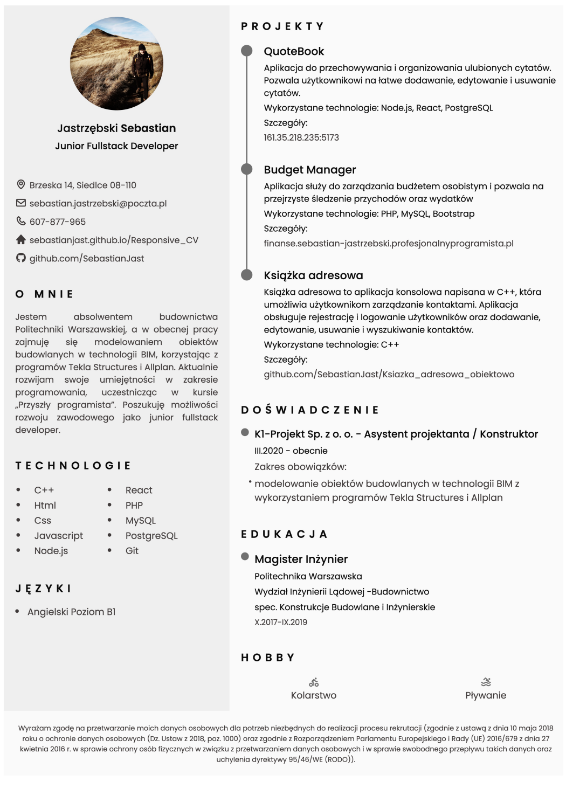

## Table of contents

- [Overview](#overview)
  - [The challenge](#the-challenge)
  - [Screenshot](#screenshot)
  - [Links](#links)
- [My process](#my-process)
  - [Built with](#built-with)
  - [What I learned](#what-i-learned)
- [Author](#author)

## Overview

### The challenge

Users should be able to:

View an interactive CV webpage with sections for contact details, skills, education, experience, and more.
Download the CV as a PDF.
Navigate through the sections using the navigation bar.

### Screenshot

### Links

- Solution URL: [Add solution URL here](https://sebastianjast.github.io/Responsive_CV/)

## My process

### Built with

- HTML5 for structuring the CV content.
- CSS3 with Flexbox for layout and styling.
- JavaScript for interactive elements (e.g., theme switching, generating PDF).
- Boxicons for icons.
- html2pdf.js for PDF generation.

### What I learned

During this project, I enhanced my skills in:

- Responsive Design: I used Flexbox and CSS techniques to create a layout that adjusts to different screen sizes.
- PDF Generation: I integrated html2pdf.js to allow users to download the CV as a PDF directly from the page.
- Interactive Features: I implemented JavaScript-based functionalities like theme switching and a button to generate the PDF, which improved the usability of the site.

## Author

- GitHub - [@SebastianJast](https://github.com/SebastianJast)
